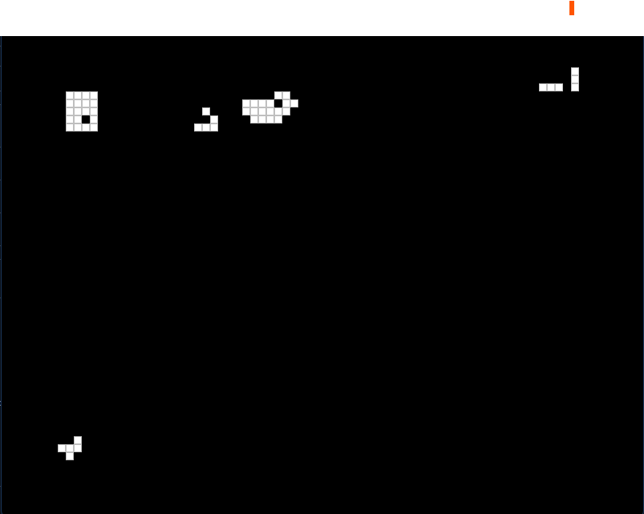
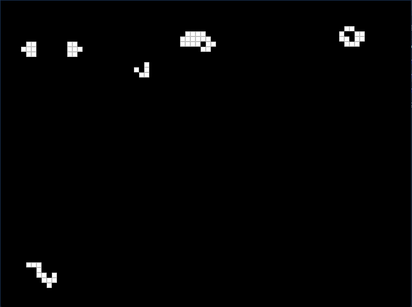
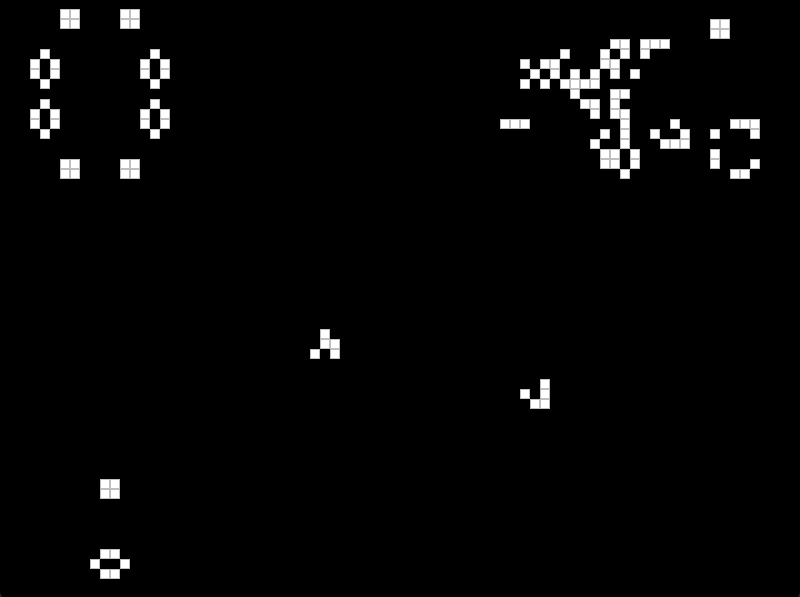
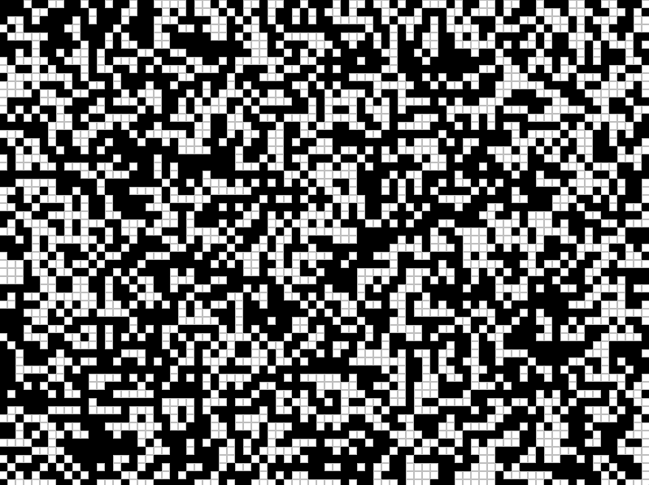
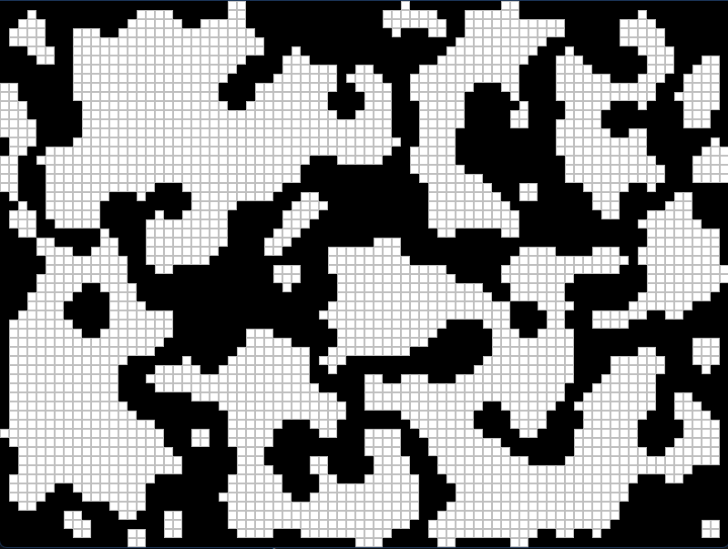

# [Conway's game of life](https://en.wikipedia.org/wiki/Conway%27s_Game_of_Life), implemented in C++

### Use `space` to pause and un-pause the game.

### Use the mouse to place cells (left click places, while right click removes).
       

### Use `C` to clear the grid, and `F` to fill 45% of the grid with cells.
   

### Use `T` to change the algorithm type (less than or equal to 4 neighbors will kill a cell, and more than 4 will create one).
   
